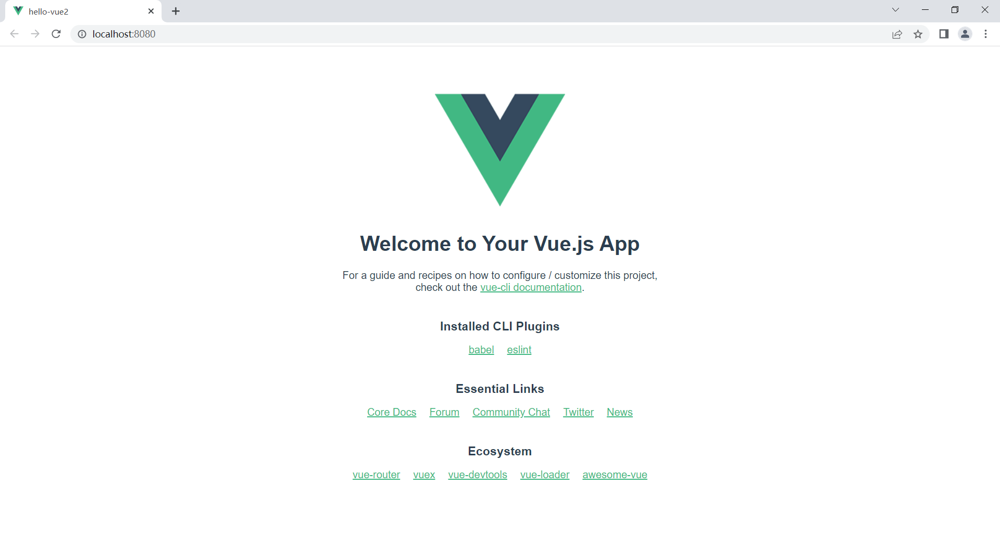

# 摘要


# 环境准备

```
C:\Users\33719>vue -V
@vue/cli 4.5.15

C:\Users\33719>node -v
v16.14.0
```

# hello world

## 初始化项目

```
vue create hello-vue2
```

刚入门不需要了解那么多，那些选项一路回车即可

## 启动

```
🎉  Successfully created project hello-vue2.
👉  Get started with the following commands:

 $ cd hello-vue2
 $ npm run serve


C:\core\frontend\vue2-learning>
```

看到上面这段就说明成功创建了。按照指示执行命令，即可启动项目

```
cd hello-vue2
npm run serve
```

## 访问

启动之后访问链接 http://localhost:8080 可见：



# 开发建议

使用 vs code 开发，安装以下插件：

1. Vetur 
2. Auto Close Tag
3. Auto Rename Tag
4. JavaScript(ES6) code snippets 
5. Path Intellisense
6. HTML CSS Support
7. open in browser


