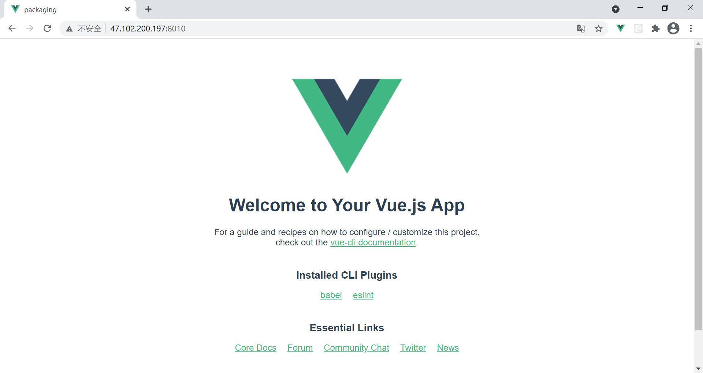

# 概述

此处演示 vue 项目打包，为了简单起见，这里的项目就用新建好的、没有经过任何修改的项目

# 步骤

## 新建项目

新建一个 vue 项目，名字随意，这里我叫 `packaging` ：

```
vue create packaging
```

剩下的一路回车即可

## 本地启动

这一步主要是为了检查项目是否正常，要是本地启动都不行，那就更别提打包发布了

```
cd packaging
yarn serve
```

访问：http://localhost:8080/ ，访问成功后执行下一步

## 打包

刚才项目本地启动，说明项目是可用的。这时，我们停止项目，然后：

```
yarn build
```

成功，在 packaging 目录下后我们可以看到 `dist`  目录，这就是打包好的文件

## 发布

### nginx

#### 将 `dist` 上传到服务器

这里不管你用什么办法都行，总之把 `dist` 上传到服务器就可以了。

这里我把 `dist` 压缩成 `dist.zip` ，上传到 `~/webapps/` 目录下，并解压缩：

```sh
unzip dist.zip -d dist
```

此时，查看目录结构，在 `~/webapps/` 目录下应有 `dist` 文件夹，这里面的内容与打包出来的内容一模一样：

```sh
[root@iZtggh9oymm8slZ webapps]# pwd
/root/webapps
[root@iZtggh9oymm8slZ webapps]# ls
dist  dist.zip
[root@iZtggh9oymm8slZ webapps]# find
.
./dist.zip
./dist
./dist/css
./dist/css/app.fb0c6e1c.css
./dist/favicon.ico
./dist/img
./dist/img/logo.82b9c7a5.png
./dist/index.html
./dist/js
./dist/js/app.c33c59f8.js
./dist/js/app.c33c59f8.js.map
./dist/js/chunk-vendors.ff672a17.js
./dist/js/chunk-vendors.ff672a17.js.map
[root@iZtggh9oymm8slZ webapps]# 
```

### nginx 转发

这里我用 `docker` 安装并启动 `nginx`  ,请确保 `docker` 可用

#### 拉取 nginx 镜像

```sh
docker pull nginx
```

#### 启动 nginx

```sh
docker run --name dist -p 8010:80 -v ~/webapps/dist:/usr/share/nginx/html -d nginx
```

- `--name dist`：名字随意，这里我叫 `dist`
- `-p 8010:80`：nginx 默认端口为 `80` ，这里为了避免端口被占用，将其映射到 `8010` 端口
- `-v ~/webapps/dist:/usr/share/nginx/html`：`/usr/share/nginx/html` 是 nginx 的默认路径，这里我将其挂载到我的目录 `~/webapps/dist` 下

#### 访问

访问 http://yourIPAddress:8010/ 可见下图：

注意：记得把上面的 `yourIPAddress` 换成`你的 IP 地址`，否则访问不到！




